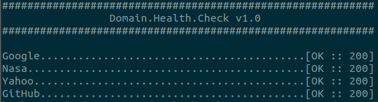

# Domain.Health.Check

Simple way to evaluates if yours domains are up. Line command and batch process.

## Usage

$ python3 domain.uptime.py

## Installation

1 - $ git clone https://github.com/humberthomattar/domain.health.check.git
2 - Alter cvs file with your domains

## Requirements

 - Python 3 >=
 - Others see requirements.txt

## Authors

domain.uptime was written by Humbertho Mattar <humberthomattar[at]gmail[dot]com>
